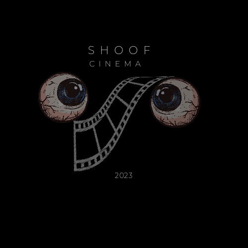
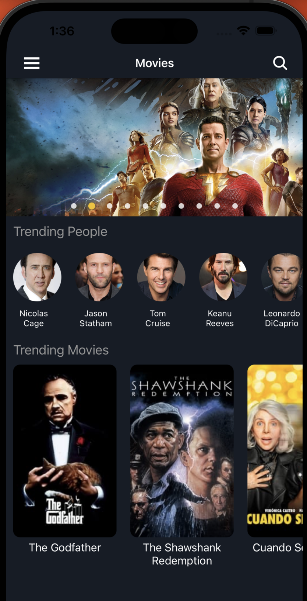
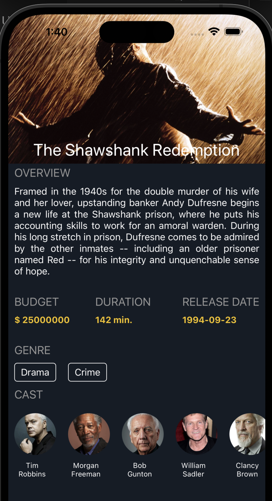
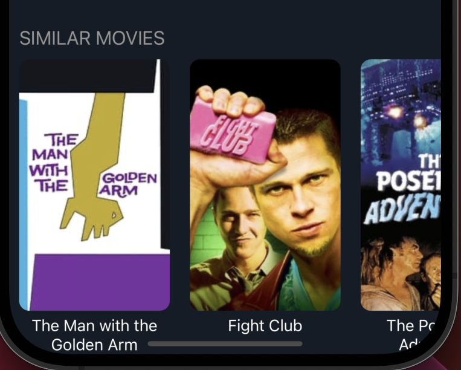

<p align="center">
  <a href="" rel="noopener">
 </a>
</p>

<h3 align="center">Shoof Cinema</h3>


<p align="center"> 
    
</p>

## 📝 Table of Contents

- [About](#about)
- [Getting Started](#getting_started)
- [Usage](#usage)
- [Built Using](#built_using)
- [User Story](#user_story)
- [Data Flow](#data_flow)
- [Guided By](#guided_by)

## 🧐 About <a name = "about"></a>

**Shoof** is the **movie application** that will help you to find , watch , discover the best and trending movies !

## 🏁 Getting Started <a name = "getting_started"></a>

These instructions will get you a copy of the project up and running on your local machine for development and testing purposes.

### Prerequisites

- Visual Studio Code follow this <a href='https://code.visualstudio.com/Download'>link</a> to install.
- Git Bash follow this <a href='https://git-scm.com/downloads'>link</a> to install.

- Node.js follow this <a href='https://nodejs.org/en/download/'>link</a> to install.


### Installing:

1. Clone the repo to your local machine using git bash.

```
git clone https://github.com/c6-AhmadQadourah/Shoof.git
```

2. Install packages repeat this step in backend and frontend folder

```
npm i expo
npm i react-native
npm i axios
npm i @react-navigation/native
npm i @react-navigation/native-stack
npm i deprecated-react-native-prop-types
npm i react-native-image-slider-box
npm i react-native-vector-icons
```


3. Run application using git bash inside the  folder

```
npm start
```

Now app ready to use

## 🎈 Usage <a name="usage"></a>

- On the **Home** page You can see the **movies** ,**Trending People** and **Trending Movies**  , updated weekly to stay always updated .
                                    



- When you  click on any movie it will navigate you to the **Movie Details** screen
  so you can know more information about the movie that you clicked on                                  



- In the movie Details screen you can also find similar  movies that you may like !
                                    



- Congratulations !   now You became one of our Family :D

- Now you ready to enjoy and discover our application amazing Features ! 
<br>
<br>
## ⛏️ Built Using <a name = "built_using"></a>


- [React Native JS](https://reactnative.dev) - Application Framework
- [Node JS](https://nodejs.org/en/) - Server Environment

## User Story <a name = "#user_story"></a>


## ⚠️ Guided By <a name = "guided_by"></a>

This project is guided by ©️ **[ courses that Provided by TV team Manager Ali al-sao ]()**
